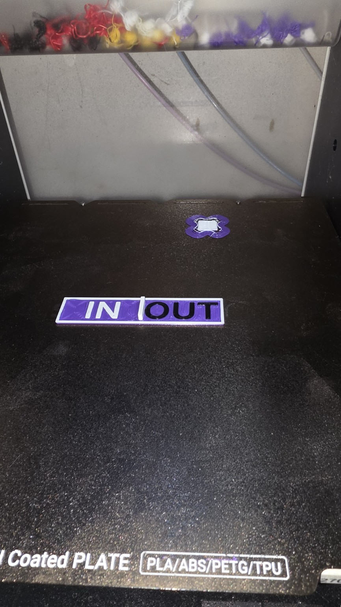

# MultiOrca

**OrcaSlicer for mixed-nozzle Snapmaker U1 printing.** MultiOrca is an experimental fork built around the U1's four independent toolheads. It builds on [OrcaSlicer](https://github.com/OrcaSlicer/OrcaSlicer) and [LixNix's multi-nozzle and multi-layer-height fork](https://github.com/LixNix/OrcaSlicer-multi-nozzle-size-printing).

> **Current status:** The source is available here, but there is no packaged MultiOrca release yet. The author's Windows build has completed its first three-color, mixed-nozzle test print; verify your G-code and printer configuration before relying on it for other prints. Some preset values refresh when the process preset is selected again after a nozzle change.

## First print



The first MultiOrca test print finished in **9 minutes**. It uses three colors and two nozzle/layer-height combinations:

| Color | Nozzle | Layer height |
| --- | --- | --- |
| Purple | 0.6 mm | 0.4 mm |
| White | 0.4 mm | 0.2 mm |
| Black | 0.4 mm | 0.2 mm |

This is one completed mixed-nozzle test print, not a claim that every combination of nozzles and layer heights has been validated.

## What it adds

| Feature | Where to find it |
| --- | --- |
| Different nozzle sizes and layer heights for T0–T3 | Printer and process settings |
| Separate speed settings for each toolhead | Process → Speed → toolhead tabs |
| Speed starting points matched to the nearest U1 nozzle preset (0.2, 0.4, 0.6, or 0.8 mm) | Select a U1 process preset after setting nozzle sizes |
| Chamber cooling/heating target for each filament | Filament settings |
| Starting chamber target, 25–75 °C in 5 °C steps; default 40 °C | Upload/print dialog |
| Optional flow calibration checkboxes for T0–T3 | Upload/print dialog |
| Simple default output filename, `{input_filename_base}.gcode` | Process → Others |
| Object exclusion enabled in the U1 process defaults | Process settings |

The **cooling/heating** label leaves room for a future heater. The current printer macro controls chamber **cooling through the exhaust fan**; it does not drive a heater.

### Example mixed-nozzle setup

Set T0, T1 and T2 to 0.4 mm nozzles with 0.12 mm layer heights, and T3 to a 0.6 mm nozzle with a 0.24 mm layer height. These are example values, not restrictions on the layer heights you may choose.

## Get started

1. **Obtain MultiOrca.** Once a tested Windows package is posted, get it from this repository's [Releases](https://github.com/tragson3-gif/MultiOrca/releases). Until then, build from source using the [build instructions below](#build-from-source-on-windows). The upstream OrcaSlicer download is a different application and does not contain these changes.
2. **Configure the U1.** Select a Snapmaker U1 printer profile and set each physical nozzle diameter correctly in printer settings. Set process layer heights and speeds for the tools you use. After changing a nozzle size, reselect the process preset to refresh its speed defaults; inspect the values before slicing.
3. **Install the printer macros** if you will use chamber control or selective flow calibration. Follow [Printer macros](#printer-macros-required-for-chamber-control-and-calibration) below.
4. **Check Machine Start G-code.** Keep one `PRINT_START` command and place `CALIBRATE_FLAGGED_TOOLS` after it if you intend to use the calibration checkboxes. The [macro repository](https://github.com/tragson3-gif/Snapmaker-U1-Community-Macros) documents a full example.
5. **Slice and inspect the preview and generated G-code.** Confirm the intended tools, layer heights, speeds, and start commands before uploading a test print.

## Printer macros required for chamber control and calibration

The macros run **on the printer**, not inside MultiOrca. Download them from **[Snapmaker U1 Community Macros](https://github.com/tragson3-gif/Snapmaker-U1-Community-Macros)**. Use that repository's README for the current installation instructions and any updated versions.

To find the files, open the macro repository, select **Code → Download ZIP**, and extract it. Alternatively, open each file in the repository and use its **Raw** or download button. The package contains:

| Printer file | What MultiOrca uses it for |
| --- | --- |
| [`flow_calibration_flags.cfg`](https://github.com/tragson3-gif/Snapmaker-U1-Community-Macros/blob/main/flow_calibration_flags.cfg) | Defines `FLOW_CAL_T0` through `FLOW_CAL_T3` and `CALIBRATE_FLAGGED_TOOLS` for the upload checkboxes. |
| [`my_chamber_control.cfg`](https://github.com/tragson3-gif/Snapmaker-U1-Community-Macros/blob/main/my_chamber_control.cfg) | Defines `START_CHAMBER_COOLING` and `SET_CHAMBER_TARGET` for the starting and filament chamber targets. |
| [`my_flow_calibration.cfg`](https://github.com/tragson3-gif/Snapmaker-U1-Community-Macros/blob/main/my_flow_calibration.cfg) | Optional manual calibration commands; separate from the upload checkboxes. |
| [`my_nozzle_clean.cfg`](https://github.com/tragson3-gif/Snapmaker-U1-Community-Macros/blob/main/my_nozzle_clean.cfg) | Optional nozzle cleaning in Mainsail; separate from the upload dialog. |

On the U1, enable **Advanced Mode** from the touchscreen's **Maintenance** menu. Place the desired `.cfg` files alongside your printer configuration, add the matching `[include ...]` lines to `printer.cfg`, then restart Klipper. For the entire macro package, the include lines are:

```ini
[include my_nozzle_clean.cfg]
[include my_chamber_control.cfg]
[include flow_calibration_flags.cfg]
[include my_flow_calibration.cfg]
```

Review the [macro installation guide](https://github.com/tragson3-gif/Snapmaker-U1-Community-Macros#readme) before changing `printer.cfg`. The macro repository explains the print start/end commands, the U1 Top Hat warning, and why its fan-off commands use `SPEED=0.001`.

### Upload controls and G-code placement

In **Machine Start G-code**, use the macro package's start sequence. In particular, retain this order:

```gcode
CANCEL_POST_PRINT_CLEANUP
START_CHAMBER_COOLING TARGET=40 RANGE=10
PRINT_START
CALIBRATE_FLAGGED_TOOLS
```

Your existing start commands can follow. The upload dialog inserts `FLOW_CAL_T0`–`FLOW_CAL_T3` **before `PRINT_START`** for the checked tools and places its selected `SET_CHAMBER_TARGET TARGET=... RANGE=10` **after `PRINT_START`**. Leave `CALIBRATE_FLAGGED_TOOLS` after `PRINT_START` so it consumes the selected flags. A U1 upload with these controls needs exactly one standalone `PRINT_START` line; selecting calibration also requires the standalone `CALIBRATE_FLAGGED_TOOLS` line. MultiOrca reports an error instead of uploading if these commands are missing.

For the optional cleanup cycle, follow the macro repository's instructions for adding `START_POST_PRINT_CLEANUP` to **Machine End G-code**. The next print should call `CANCEL_POST_PRINT_CLEANUP` at the start.

The filament target is set in the filament profile and can be adjusted to individual degrees. The upload dialog supplies a starting target in five-degree steps. The installed macro currently cools the chamber by controlling the exhaust fan; it cannot heat the chamber.

## Build from source on Windows

This repository contains source code, not a Windows installer. Follow the [upstream OrcaSlicer build prerequisites](https://github.com/OrcaSlicer/OrcaSlicer/wiki/How-to-build) to set up Visual Studio, CMake, and dependencies. In PowerShell, from the repository directory after configuring its `build` directory:

```powershell
cmake --build build --config Release --target ALL_BUILD --parallel 8
```

The compiled application is typically at `build\src\Release\orca-slicer.exe` in this Windows build layout. If you already have a working configured build, clone and build the **`u1-multiorca` branch**, which is this repository's default branch. Avoid using GitHub's **Sync fork** button without reviewing incoming changes against the U1 modifications.

## Known limits

- After changing a nozzle diameter, you may need to reselect the process preset to load the matching speed baseline. Confirm your custom speeds before accepting a preset switch, because selecting a process can change edited values.
- The chamber target uses the cooling macro today. A heating macro has not been added.
- The print/upload dialog and source have been exercised in the author's setup; a packaged release and a full end-to-end test of every macro combination are still pending.

## Credits and license

MultiOrca is a fork of [LixNix/OrcaSlicer-multi-nozzle-size-printing](https://github.com/LixNix/OrcaSlicer-multi-nozzle-size-printing), itself based on [OrcaSlicer](https://github.com/OrcaSlicer/OrcaSlicer). Thanks to their contributors for the slicer and mixed-nozzle groundwork. This repository retains OrcaSlicer's [AGPL-3.0 license](LICENSE).
